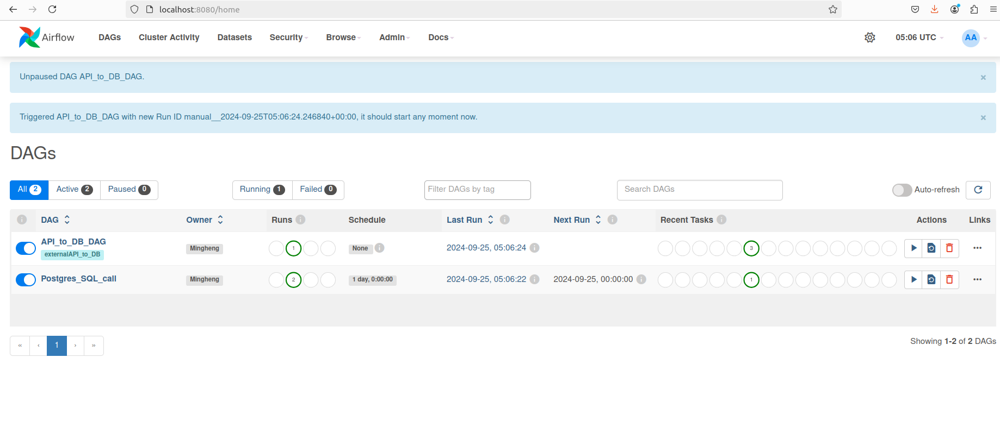

# Docker Airflow Local 

Sample repository to setup Docker Airflow based on 
[Official Airflow documentation](https://airflow.apache.org/docs/apache-airflow/stable/howto/docker-compose/index.html)


## 1. Tooling

### 1.1 Install Docker and docker compose (based on Ubuntu 22.04 LTS)

1. Setup docker and docker compose based on [following](https://docs.docker.com/engine/install/ubuntu/#install-using-the-repository)

2. User and usergroup management
```
sudo usermod -a -G docker $USER
grep docker /etc/group
newgrp docker

sudo service --status-all 
sudo service docker start
```


### 1.2 Database query and admin tool
- Airflow backing DB is PostgresDB
Will use the same PostgresDB with different schema for ETL examples

- [Dbeaver Community Edition](https://dbeaver.io) used as DB admin tool for manual SQL verify and check 


## 2. Dependencies & Config Management
###  2.1 Python package requirements
Manage locally with `pipenv`
<br>Dependencies Stored in `requirements.txt`
<br>Docker image build will install dependencies


### 2.2 Configuration and secrets management
Managed in `.env` file


## 3. Airflow Config Settings
### `docker-compose.yaml` configurations done
  - Turned off airflow example dags
  - Port mapping to expose postgres container port so can connect with Database engine 
  - Add directory mount for `/sql`
  - Build Airflow image from Dockerfile which will install Python dependencies


  ## 4. Example DAG use cases in `dags/`

4.1 Directories for SQL scripts to do ETL
<br> 4.2 API call to external data source and load into database  

  ### 4.1 `sampleSQL.py`
  Run `/sql/sample.sql` on database

  ### 4.2 `sampleAPIcall.py`
  API call to external data source, transform and load into database


